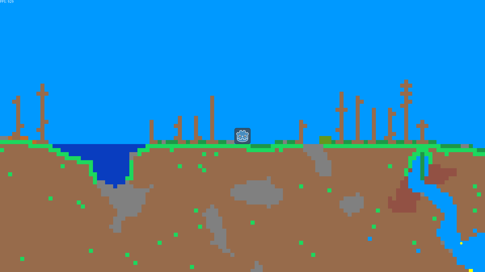

# 🌳 GoTeria 🌳

A Terraria inspired game using the Godot 3.x engine.

## History of Teria

Previous versions of Teria...

### Gamemaker Studio 2.0

This was the most naive version. Every block in the world was an instanced object, and collision was an O(n) operation between every block. The entire world was stored in an array. I could not get more than rougly 1000 blocks on the screen to reach 60 fps.

### Processing 3.0 (1)

This attempt made me realise how important it is to have a structured scene, because multiple objects required an update() and draw() call. Processing is not very good for large projects as the in built editor does not scale as the amount of classes increases. However, one of the large breakthroughs I found with this version is that collision did not require O(N) operations. This figure could be reduced as long as you are reduce your search space for the player to be only blocks that include the player's vector of movement. Still, the amount of blocks could not exceed around 1000 * 1000 due to the world's data taking up too much space. A more ellegant solution was required.

### Processing 3.0 (2)

Attempt number 3 took me back to processing again. This time I wanted to include two important features. The first was a camera that could zoom and the second was a chunk system. The idea was similar to Minecraft -> split the world into a discrete number of chunks. When these chunks are not visible to the player, load them on the disk and out of Ram. This worked well, but now I ran into a new problem. Stremaing chunks. A big bottleneck in this operation was File IO and the main thread loading the chunks would block until the operation was complete. My camera zooming feature was great, but once the player zoomed out past a certain amount, the performance of the game tanked. I needed a new solution to this problem.

### OpenFrameworks [GitHub](https://github.com/JaedanC/ofTeria)

OpenFrameworks was very similar to Processing, but was instead written in C++. This was a great opportunity to teach myself a new langauge and, of course, try out my next big idea. From University, I learnt a lot about memory mapping files. This solution looked like the boost in IO performance I required. Yes, the boost in performance was good, but this did not reduce the lag spikes of loading in chunks to an acceptable amount. I had been putting off what the next logical step in this operation would be for a long time. Multi-threading. My project was already getting quite large in OpenFrameworks, and similar to processing, it became obvious that it wasn't designed to be used as a game engine. I can only describe what happened as pointer redirection hell. The game still did not use a scene tree or similar-like structure to handle input events, updates, or drawing. I took what I learnt from this aside, and set up to create version 5 of Teria. This time, I wanted to use a Game Engine. It needed to have these features:

1. The flexibility I required to write classes and have them interact how I desired.
2. Support Multi-Threading
3. Support external editors
4. Have an easy to learn Scene Tree system
5. Have already implemented mathematical classes (eg. Vectors)
6. Preferably collision detection (because this was hard to do correctly).
7. A mature community so that I had enough resources to learn as I went.

### Godot Engine

I investigated the Godot engine as a potential candidate for Teria 5.0. It had all the features I required, and the base of the Engine was written in C++. The performance I shill for. The GDScript langauge was similar to python and easy to learn. The performance of GDScript was ~okay for bein with. I was more concerned about learning how the engine worked first.

#### Problem #1. Loading chunks

Using a threadpool was the answer... or so I thought. Loading the chunks using a Threadpool was great. Lag spikes were basically gone. However, use threads presented an even bigger evil; Race conditions. I present to you this scenario:

What should you do if a chunk is being loaded (or is queued to be loaded) and the player then comes within vision distance of the chunk? Well, actually this could happen very easily.

**Solution #1:** Load chunks off screen so this is likely to not happen. Duh, Jaedan. Although this does not fix anything. A player moving fast enough could easily outpace the loading of a chunk with this current system. So now, we have a player zooming around the world and the chunk loading could not keep up.

**Solution #2:** Force load chunks that are within a certain range of the player. This introduces a nasty trade-off. Move slowly, and the loading is smooth as butter. Move too quickly and it turned into a stuttery mess. Not to mention this solution was implemented incorrectly to begin with because instead of waiting for the chunk to load, I instead started the loading of the chunk with the main thread even if the ThreadPool still had that chunk to load. This worked for a short while until I added solution 3.

**Solution #3:** It was around about this time I realised that a majority of the lag spikes occuring was not because the player was loading chunks to quickly. Actually, by this point a majority of the spike came from the destruction of the chunk when it left the screen. To solve this issue I added an object pool for the chunks. When they moved offscreen they were sent to the pool. When they needed to be instanced again, they were reset and given back to the terrain. However, above you may have noticed that this solution broke #2. Yes, race conditions. What happens in this scenario:

1. A chunk is marked to be loaded and it sent to the ThreadPool to be loaded.
2. A player is moving at a very high speed and because of this, we force load in the chunk on the main thread. The ThreadPool is still waiting to process the chunk.
3. The player continues moving quickly and now the chunk has gone off the screen. We send this chunk the object pool.
4. The player loads a new chunk, retrieving the chunk we just just to the pool.
5. Step 2 happens again.
6. Now, we have the same chunk in the ThreadPool twice. One has old data, the second has the correct data. It is now a race to see which chunk is loaded first. If the correct data is loaded first, the incorrect data comes second, and completely overrides the contents of the chunk.
7. Lo and behold in very very very rare circumstances a chunk is loaded with the completely WRONG set of blocks.

**Solution #4:** This is more a fix to solution #3 but the obvious answer was to wait for the Thread to finish in the queue before we continue execution. Tracking down the bug above was difficult though. A good lesson I must say. This still did not remove all the stutter as the contents of the chunk being reset was now the garbage collectors next victum to tank performance.

**Solution #5:** This is when I ported everything over to C# Mono with the hopes of gaining a performance boost. After 20 long hours of rewriting everything... the spikes still happened. So, I pressed on.

**Solution #6:** The Chunks block data is stored as an Array (that is a Godot.Array) of Dictionary (Godot.Dictionary). This data structure is reference counted. Instantiating a new block array killed the game's performance because C#'s garbage collector needed to clean up the old array. So, my next solution was to change this data structure to use a real Array `[]` and only create this array of blocks once. When the chunk is loaded, we can store the blocks in this array. This fixed two problems. The first is that we don't need to garbage collector doing an expensive clear every frame (on average). The second is that we aren't allocating large sections of memory on the heap every frame. This final piece in the chunk loading puzzle resulted in some seriously stellar performance:

~1000 fps even while:

- Running a 8400x2400 world
- Zoomed out to view millions of blocks
- Player is moving at ludicrous speeds
- Not even in Release mode
